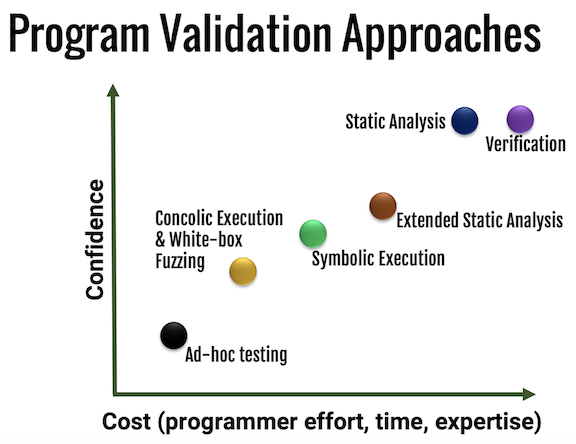

# Verification & Formal Methods

In a perfect world, all software at OneChronos would be [verified](https://en.wikipedia.org/wiki/Formal_verification). That's not the reality; formal verification is often prohibitively difficult and expensive, and [not always possible](https://en.wikipedia.org/wiki/G%C3%B6del%27s_incompleteness_theorems). That said, formal methods are actually a productivity booster in certain cases. When the system under test is readily modeled as a [finite state machine (FSM)](https://en.wikipedia.org/wiki/Finite-state_machine) it's often easier to write out invariants than think though test cases. The same is often true for low-level proofs of equivalence, e.g. proving a compiler optimization correct. The proofs that power formal methods offer the highest guarantees of correctness possible, and as an added bonus, they're typically more compact than an exhaustive test suite. That said, they can be much harder to write.



NB: this graph [^validation_graph] should include a dot below ad-hoc testing for "PL static analysis," e.g. linting and the use of "pedantic" compiler warnings

Our rules and guidelines from program validation are as follows:

* Shallow static analysis:
  * __Example tools__: clang-tidy, pylint, compilation with whatever the language specific ```-Wall``` is
  * __Example targets__: all software written at OneChronos
  * __Use__: always
  * __Good at__: catching typos and PL use bugs
  * __Bad at__: catching logic bugs, or anything more structural
* (Less) shallow static analysis:
  * __Example tools__: JetBrains IDEA, Clang Static Analyzer, FB Infer
  * __Example targets__: all software written at OneChronos
  * __Use__: always
  * __Good at__: catching slightly more involved bugs, e.g. NPEs, some instances of use-after-free, dead code
  * __Bad at__: catching logic bugs
* Ad-hoc testing
  * __Example tools__: unit and behavioral tests
  * __Example targets__: all software written at OneChronos
  * __Use__: always, subject to the guidelines above
  * __Good at__: documenting and verifying that a known set of assumptions hold
  * __Bad at__: verifying that assumptions hold in the general case
* Fuzzing:
  * __Example tools__: property testing
  * __Example targets__: all software written at OneChronos
  * __Use__: almost always, subject to the guidelines above
  * __Good at__: expanding coverage beyond ad-hoc testing
  * __Bad at__: verifying critical systems, unless supplemented with other, more powerful methods
* Concolic execution & white-box fuzzing
  * __Example tools__: instrumentation guided fuzzers such as AFL
  * __Example targets__: XDP code for network timestamp manipulation
  * __Use__: when practical
  * __Good at__: exercising code paths - something that's crucial for testing languages without strong memory and type safety; taking a starting set of behavioral test cases with invariants and verifying that the invariants hold for similar test cases
  * __Bad at__: scaling to large systems or demonstrating that invariants hold in general
* Symbolic execution: when strong guarantees of correctness are important but not required
  * __Example tools__: using z3 to trace program execution and exhaustively explore all code paths
  * __Example targets__: proxy bidder analysis
  * __Use__: when practical
  * __Good at__: exhaustively exercising code paths; symbolic execution is the deterministic but far less scalable cousin of concolic execution
  * __Bad at__: scaling
* Deep static analysis:
  * __Example tools__: walking a program's AST/CFG and using z3 to prove invariants along the way
  * __Example targets__: combinatorial bid analysis
  * __Use__: when strong guarantees of program correctness are necessary, but formal verification is out of reach
  * __Good at__: verifying that a computer program is crash-free/deadlock-free
  * __Bad at__: verifying that a computer program produces the intended result for all possible inputs
* Formal verification:
  * __Example tools__: theorem proving with Imandra/z3/TLA+
  * __Example targets__: verifying certain properties of proxy bidders and combinatorial bids; verifying the distributed consensus protocol used for running auctions
  * __Use__: when the situation at hand calls for the strongest guarantees of correctness possible
  * __Good at__: proving that the expected invariants hold for all possible program inputs
  * __Bad at__: scaling, or being easy to do

[^validation_graph]: [Symbolic and Concolic
Execution of Programs. Omar Chowdhury 2015](https://www.cs.purdue.edu/homes/ninghui/courses/526_Fall15/handouts/SymExec.pdf)
